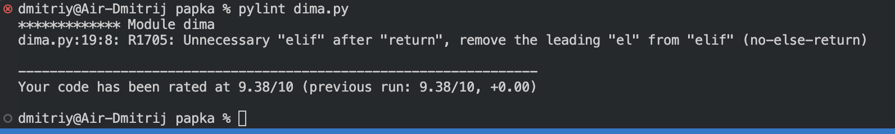
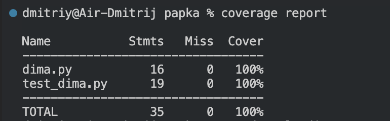

## Домашнее задание по семинару № 6 "Юнит тестирование в других языках

 При выводе отчета pylint присутствовали сообщения об отсутсвии документации и о присутствии не необязательного else который запускался при равных значениях средних значений.

Инструмент coverage показал 100% покрытие тестом

